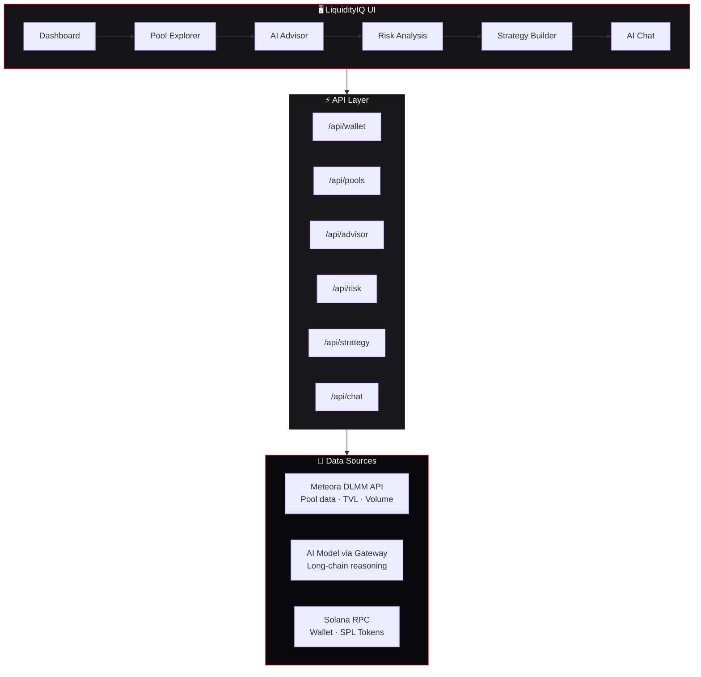

<div align="center">

# 📊 LiquidityIQ

### AI-Powered DLMM Liquidity Management Platform

**Intelligent pool discovery · Risk assessment · Strategy building**

[](http://194.233.83.169:3001)
[](https://opensource.org/licenses/MIT)
[](https://nextjs.org/)
[](https://www.typescriptlang.org/)
[](https://solana.com/)
[](https://www.meteora.ag/)

<br/>


</div>

---

## ✨ What is LiquidityIQ?

LiquidityIQ is a full-stack **DeFi intelligence platform** that combines real-time on-chain data with AI-powered analysis to help users navigate **Meteora DLMM pools** on Solana.

> **Problem:** Navigating 30+ DLMM pools with varying risk profiles is complex and time-consuming.
>
> **Solution:** AI agents analyze pools, assess risk, and build personalized strategies — so you can make informed decisions faster.

---

## 🚀 Features

| Feature | Description |
|---------|-------------|
| 📊 **Dashboard** | Connect Solana wallet, view SOL balance + SPL token holdings, portfolio tracking |
| 🏊 **Pool Explorer** | 30+ live DLMM pools with real-time TVL, Volume 24h, Fee, Organic Score, Holders |
| 🤖 **AI Pool Advisor** | Input budget + risk tolerance → 3-5 AI-scored pool recommendations with reasoning |
| 🛡️ **Risk Analysis** | 5-factor risk assessment (0-100): Liquidity Depth, Smart Contract, IL, Counterparty, Volatility |
| ⚙️ **Strategy Builder** | Goal + capital + experience → custom DLMM strategy with expected APY |
| 💬 **AI Chat** | Conversational DeFi assistant — context-aware, expert on Meteora & Solana DeFi |

---

## 🏗️ Architecture



---

## 🛠️ Tech Stack

| Layer | Technology |
|-------|-----------|
| **Framework** | Next.js 14 (App Router) |
| **Language** | TypeScript |
| **Styling** | Tailwind CSS + Custom CSS Variables |
| **Font** | VT323 (Google Fonts) |
| **Blockchain** | Solana Mainnet (RPC) |
| **DLMM Data** | Meteora DLMM API |
| **AI** | OpenAI-compatible API via proxy gateway |
| **Deployment** | VPS (Node.js production server) |

---

## 📁 Project Structure

```
liquidity-iq/
├── app/
│   ├── api/
│   │   ├── advisor/route.ts    # AI pool recommendations
│   │   ├── chat/route.ts       # AI chat endpoint
│   │   ├── pools/route.ts      # Meteora pool data
│   │   ├── risk/route.ts       # Risk analysis
│   │   ├── strategy/route.ts   # Strategy builder
│   │   └── wallet/route.ts     # Wallet data (SOL + tokens)
│   ├── advisor/page.tsx        # AI Advisor UI
│   ├── chat/page.tsx           # AI Chat UI
│   ├── pools/page.tsx          # Pool Explorer UI
│   ├── risk/page.tsx           # Risk Analysis UI
│   ├── strategy/page.tsx       # Strategy Builder UI
│   ├── page.tsx                # Dashboard
│   ├── layout.tsx              # Root layout
│   └── globals.css             # Global styles + theme
├── components/
│   └── Sidebar.tsx             # Navigation sidebar
├── lib/
│   └── ai.ts                   # AI API wrapper
├── .env.example                # Environment template
├── tailwind.config.js          # Tailwind + color palette
├── package.json
└── README.md
```

---

## 🚀 Getting Started

### Prerequisites

- **Node.js** 18+
- **npm** or **yarn**
- A Solana wallet address (for testing)
- AI API credentials (OpenAI-compatible endpoint)

### Installation

```bash
# 1. Clone the repository
git clone https://github.com/nov1talia/liquidity-iq.git
cd liquidity-iq

# 2. Install dependencies
npm install

# 3. Configure environment
cp .env.example .env
```

### Environment Variables

Edit `.env` with your credentials:

```env
# AI API Configuration (OpenAI-compatible endpoint)
AI_API_KEY=your_api_key_here
AI_BASE_URL=https://your-api-endpoint.com/v1
AI_MODEL=your_model_name

# Solana Configuration
SOLANA_RPC_URL=https://api.mainnet-beta.solana.com
SOLANA_WS_URL=wss://api.mainnet-beta.solana.com

# Meteora API
METEORA_API_URL=https://dlmm-api.meteora.ag
```

| Variable | Description |
|----------|-------------|
| `AI_API_KEY` | Your AI API key |
| `AI_BASE_URL` | OpenAI-compatible API base URL |
| `AI_MODEL` | Model identifier (e.g. `gpt-4o`) |
| `SOLANA_RPC_URL` | Solana RPC endpoint for wallet data |
| `METEORA_API_URL` | Meteora DLMM API for pool data |

### Run

```bash
# Development
npm run dev

# Production
npm run build
npm start
```

Open [http://localhost:3000](http://localhost:3000) in your browser.

---

## ⛽ Token Consumption

Each AI call uses the configured model via API gateway:

| Feature | Tokens/Call | Calls/Session | Total/Session |
|---------|------------|---------------|---------------|
| AI Advisor | ~2,000 | 3-5 | ~6K-10K |
| Risk Analysis | ~2,400 | 5-10 | ~12K-24K |
| Strategy Builder | ~1,700 | 2-3 | ~3.4K-5.1K |
| AI Chat | ~1,100 | 10-20 | ~11K-22K |

**Per user session:** ~32K-61K tokens

---

## 📊 Data Sources

| Source | Description | Link |
|--------|-------------|------|
| **Meteora DLMM API** | Real-time pool metrics, TVL, volume, organic scores | [meteora.ag](https://www.meteora.ag/) |
| **Solana RPC** | SOL balance, SPL token accounts | [solana.com](https://solana.com/) |
| **AI Model** | Long-chain reasoning for DeFi analysis | OpenAI-compatible API |

---

## 🤝 Contributing

Contributions are welcome! Please feel free to submit a Pull Request.

1. Fork the repository
2. Create your feature branch (`git checkout -b feature/amazing-feature`)
3. Commit your changes (`git commit -m 'feat: add amazing feature'`)
4. Push to the branch (`git push origin feature/amazing-feature`)
5. Open a Pull Request

---

## 📜 License

This project is licensed under the MIT License — see the [LICENSE](LICENSE) file for details.

---

## 🔗 Links

- **Live App:** [LiquidityIQ](http://194.233.83.169:3001)
- **GitHub:** [github.com/nov1talia](https://github.com/nov1talia/)
- **Meteora:** [meteora.ag](https://www.meteora.ag/)
- **Solana:** [solana.com](https://solana.com/)

---

<div align="center">

**Built with ❤️ for the Solana DeFi community**

</div>
